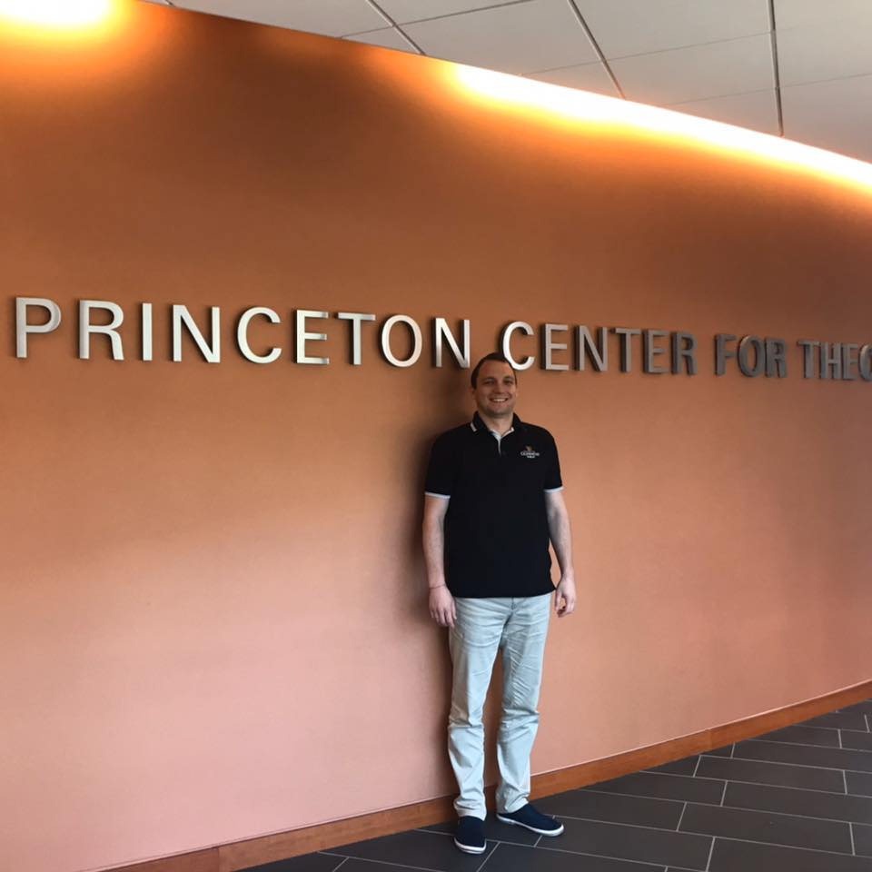

<!--Intro -->

  

    

      <!--Main Image-->
      
      <!--Social icons-->
      

        <a target="_blank" href="https://www.linkedin.com/in/vgvassilev/">
          
        </a>
      

      <!--End Social icons-->
    

  

  

    

      <!--Main Name-->
      <h1>Vassil Vassilev, PhD</h1>
      <h3>Research Software Engineer and IT Consultant</h3>
      <h4>
        
      </h4>
    

    

      A motivated individual with a PhD degree in computing and experience in big
      data analysis frameworks. Experienced system engineer, expert in the field
      of compiler construction and technologies such as LLVM and Clang. Authored
      the C++ interpreter Cling and contributed to Clang's C++ modules adoption
      and implementation. Proficiency in C++, STL, ROOT, Cling, LLVM, Clang.
      Good communicator, acknowledged for the effective translation of problems
      to the generation of efficient solutions.
    

    

      Bulgarian national body representative for ISO SC22 and WG21 (ISOCPP) standardization committees.
    

    

      

        <a class="btn btn-primary system_btn quick_btn" data-toggle="modal" data-target="#more_details">Quick Profile View</a>
      

    

  

<!--End Intro-->

<!--Some Facts-->

  

    

      <h2>Some facts</h2>
      <!-- Prepare a container for your github calendar. -->
      

        <!-- Loading stuff -->
        Loading the data just for you.
      

    

  

<!--End Some Facts-->

<!--Bio-->
<h2>Bio</h2>

  I was born in 1987 in Karlovo, Bulgaria. Graduated high school in
  2006. Received my BSc in "Informatics" in 2009, MSc in "Software
  Technologies" in 2010 and PhD in "Computing" in 2015 from University
  of Plovdiv, "Paisii Hilendarski", Plovdiv, Bulgaria.
  
  I ran my own company from 2008 until 2010. In the same time was
  a teaching assistant in the University of Plovdiv. In 2011 made an
  internship at CERN and became a CERN fellow from 2012 until 2014.
  
  In 2015 became a FermiLab contractor at CERN. In 2017 became a
  consultant for Princeton University and from 2019 until present
  I am a research software engineer.

<!--End Bio-->

<!--Personal info-->

  

    

      <table class="table table-responsive">
        <tbody>
          <tr>
            <th class="pb40">Name</th>
            <th class="pb40">:</th>
            <td class="pb40">Vassil Vassilev</td>
          </tr>
          <tr>
            <th class="pb40">Email</th>
            <th class="pb40">:</th>
            <td class="pb40"><a href="mailto:v[dot]g[dot]vassilev[at]gmail[dot]com" target="_top">v[dot]g[dot]vassilev[at]gmail[dot]com</a></td>
          </tr>
          <tr>
            <th>Website</th>
            <th>:</th>
            <td><a href="http://vassil.vassilev.info" target="_blank">vassil.vassilev.info</a></td>
          </tr>
        </tbody>
      </table>
    

  

<!--End Personal info-->

<!-- Quick Profile showcase Modal starts -->

  

    <!-- Modal content-->
    

      

        <button type="button" class="close" data-dismiss="modal">&times;</button>
        <h4 class="modal-title">Vassil's Profile View</h4>
      

      

        

          

            <ul class="modal_profile mb40">
              <li>
                
                

                  <h3>Vassil Vassilev</h3>
                  
Research Software Engineer

                  

                    
                    Geneva, CH / Princeton, NJ / Karlovo, BG.
                  

                  

                    C++
                    Compiler Technology
                    Performance Engineering
                    System Programming
                    Project Management
                  

                

                
              </li>
            </ul>
            

          

        

        

          

            

              

                <h6 class="system_font_color">Work History</h6>
                <h5>Sibelius Ltd, CERN, FNAL, Princeton</h5>
              

              

                <h6 class="system_font_color">Availability</h6>
                <h5>40 hours/week full time</h5>
              

              
              

                <h6 class="system_font_color">Week Availability</h6>
                

                  S
                  M
                  T
                  W
                  T
                  F
                  S
                

              

            

            

              

                    <h6 class="system_font_color">Language</h6>
                    <h5>English, Bulgarian</h5>
              

              

                <h6 class="system_font_color">Check out my research profiles</h6>
                

                  
                

              

              

                <h6 class="system_font_color">Social</h6>
                

                  <a target="_blank" href="https://www.linkedin.com/in/vgvassilev/">
                    
                  </a>
                

              

            

          

        

      

    

  

<!-- Quick Profile showcase Modal ends -->

<!-- Prepare a container for your calendar. -->

<!-- Optionally, include the theme (if you don't want to struggle to write the CSS) -->
<link rel="stylesheet"
      href="https://unpkg.com/github-calendar@latest/dist/github-calendar-responsive.css"/>

